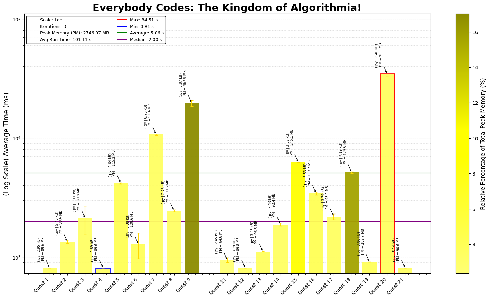

# Everybody Codes 2024 - The Kingdom of Algorithmia

This repository contains coding solutions for the 2024 Everybody Codes. Each day's challenge offers unique puzzles requiring efficient coding, algorithmic thinking, and optimization.

## Day-by-Day Coding Overview

1. **Day 1 - Letter Fighters**: Count number of letters in a series of strings, keeping track of groups and assigning different weights
2. **Day 2 - Word Search Algorithms**: Looking for specific string groups in a series of strings, using a Breadth-Find Search for Part 3.
3. **Day 3 - Game of Life**: Mine the ground based on  conditions surrounding it
4. **Day 4 - Number Lists and Math**: Throwback to simple maths, requiring simple addition.
5. **Day 5 - Rotating Columns**: Weird Dances and rotating columns.
6. **Day 6 - Word Trees**: Generate a word tree using networkx libraries
7. **Day 7 - Race Tracks**: Identify results of a race and different permutations to win.
8. **Day 8- Building Shrines**: Build a shrine using numbered blocks with various different construction restrictions.
9. **Day 9- How to build a number**: Using recursion find the different combinations that can be used to build a number.
10. **Day 10- Fill in Word Grids**: Similar to sudoku but for words, pretty fun except for Quest 3
11. **Day 11- Termite Population**: Simulate the growth of termites based on previous roles
12. **Day 12- Angry Birds**: Projectile motion but on a grid, similar to good ol Angry Birds
13. **Day 13- Grid Traversal**: Traverse grid w/ different levels using Djikstra algorithm
14. **Day 14- Build Trees**: Follow commands to build trees, and find different attributes of it
15. **Day 15- Pathfinding on grid**: Racing for herbs by finding the shortest path
16. **Day 16- Slot Machines**: Turn the slot machine to win coins
17. **Day 17- Stars and Constellations**: Use Manhattan distance to count constellations
18. **Day 18- Mapping Water Flow**: Map the flow of water from various points in a grid
19. **Day 19- Decoding Messages**: Decode messages based on a series of 'L','R' keys
20. **Day 20- Altitude for Gliders**: Find the highest point a glider can reach in the sky