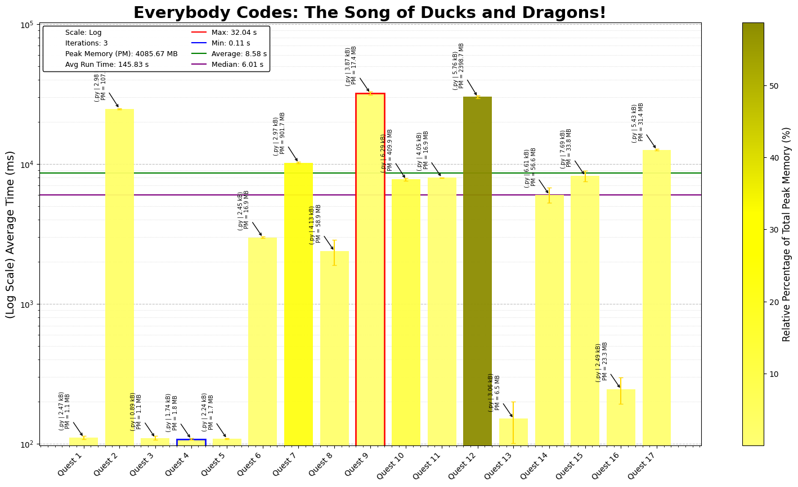

# Everybody Codes 2025 - The Song of Ducks and Dragons 

This repository contains coding solutions for the 2025 Everybody Codes. Each day's challenge offers unique puzzles requiring efficient coding, algorithmic thinking, and optimization.

## Day-by-Day Coding Overview

1. **Day 1 - Whispers in the Shell**: Fairly simple challenges for list indexing and manipulation.
2. **Day 2 - From Complex to Clarity**: Vector Math, fairly simple execution once you get over the hurdle of integer and div math. *Improve P3*
3. **Day 3 - The Deepest Fit**: Why write your own functions, when python can do it for you. LEARN PYTHON Kids
4. **Day 4 - Teeth of the Wind**: MATH IS FUN
5. **Day 5 - Fishbone Order**: Interesting way to build a tree fairly simple overall, but figuring out how to skip over segments took a bit of time.
6. **Day 6 - Mentorship Matrix**: Perfect Problem that shows how decisions at the start can save time towards the end, which alas I did not
7. **Day 7 - Namegraph**: Validate names according to a series of rules, and then extend it according tot he same rules usinng a bfs
8. **Day 8 - The Art of Connection**: Not a bad puzzle overall but geometry is really annoying
9. **Day 9 - Encoded in the Scales**: Compare strings to calculate similarity, and build family trees. *Improve P3*
10. **Day 10 - Feast on the Board**: Dragon Chess, all the good maze algorithms at once what more could one ask for
11. **Day 11 - The Scout Duck Protocol**: Is it an elegant solution, no but it works so yk all's good.
12. **Day 12 - One Spark to Burn Them All**: Floodfill algorithms at its best, P3 is a brute force approach with minor optimisations to remove dead barrels *Improve P3*
13. **Day 13 - Unlocking the Mountain** Who knew building dials could be fun and deque is COOL.
14. **Day 14 - The Game of Light**: A play on the Game of Life, fairly basic 1 and 2 with cycle detection P3.
<<<<<<< HEAD
15 **Day 15 - Definitely Not a Maze**: Build your maze, traverse it, scaled to a 1000.
=======
15 **Day 15 - Definitely Not a Maze**:
>>>>>>> b16040bae43ff2449a67107aa6e11386da51fa68
