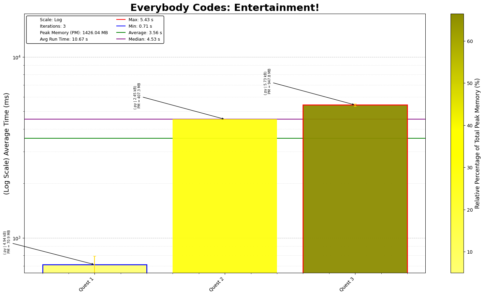

# Everybody Codes - Echoes of Enigmatus

## Day-by-Day Coding Overview

1. **Quest 1 - Nail Down Your Luck**: Simple slot machine puzzle, that requires you to follow fairly simple set of rules. Couple of tricky steps, with how to handle the starting and final slots, but overall nothing too tricky. Part 3 was kind of interesting but scipy, simplified it. Potential for a playable game to be created with some visualization.